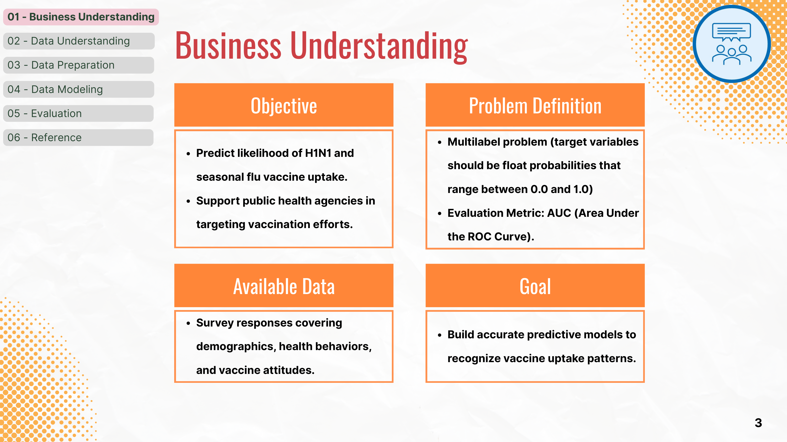
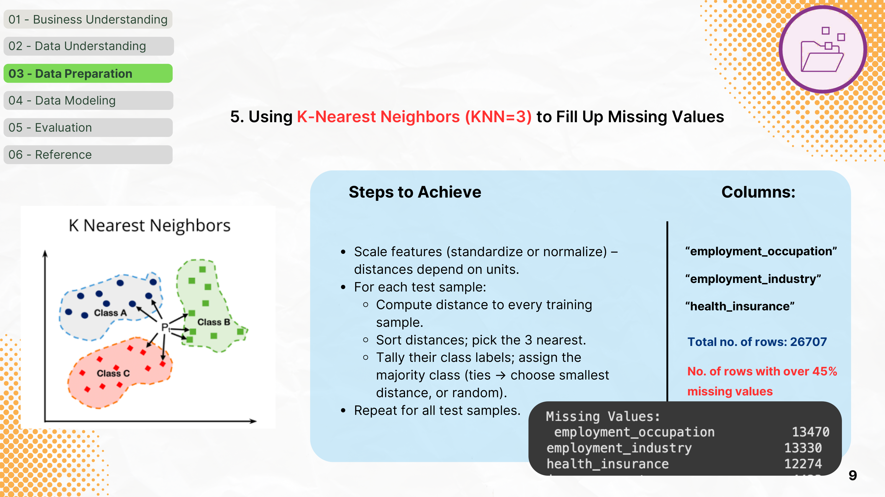
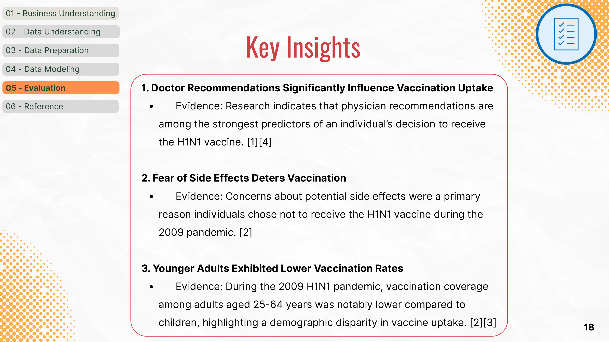
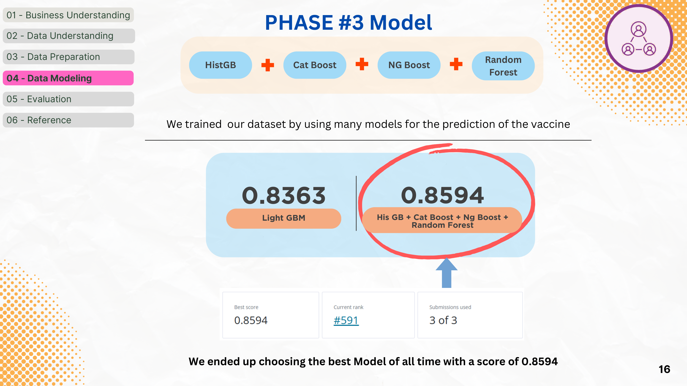
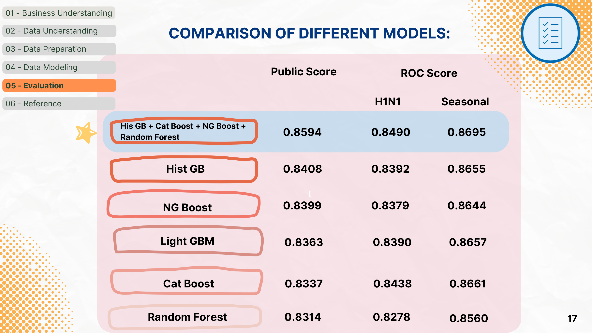

  
  # Flu Shot Learning: Predicting Vaccine Uptake
  **A Data Mining Case Study**

  

    
    
    
  

  > *Can we predict who will get the flu vaccine based on their background, opinions, and health behaviors?*

 

## Project at a Glance

<table>
<tr>
<td width="50%">

### The Challenge
Public health agencies struggle to achieve target vaccination rates. If we can **predict vaccine uptake** based on demographics and behaviors, campaigns can be highly targeted, optimizing supply chains and messaging.

</td>
<td width="50%">

### The Outcome
An advanced ensemble model combining **HistGB, CatBoost, NGBoost, and Random Forest** that achieves an **AUC of 0.8594**, revealing critical demographic gaps and behavioral drivers.

</td>
</tr>
</table>

  

 

## The Data Story

The National 2009 H1N1 Flu Survey (NHFS) provided **26,707 records** with **35 features**. But real-world data is messy. 

<b>[ View Technical Details ] Advanced Data Preparation</b>

 

Handling missing data was the most critical step of this project.

1. **Logic-Based Imputation:**
   We mapped known demographic rules. For example, if `age_group` is "65+ Years", missing `employment_status` was confidently filled as "Not in Labor Force".

2. **K-Nearest Neighbors (KNN) Imputation:**
   Features like `employment_occupation` had over **45% missing values**. Instead of dropping them, we used **KNN (K=3)**.
   
   *How it works:* We computed distances to the nearest training samples based on scaled features and assigned the majority class of the 3 nearest neighbors.

 

  

 

## Key Insights

Our analysis unearthed three pivotal behavioral insights that directly inform public health strategies:

| Theme | Finding | Impact |
| :--- | :--- | :--- |
| **Doctor Influence** | **Physician recommendations** are the strongest predictor of vaccination. | Campaigns should incentivize doctors to actively recommend the vaccine. |
| **Side Effect Fears** | Concerns about **vaccine safety and side effects** heavily deter uptake. | Messaging must explicitly address safety to combat misinformation. |
| **Demographic Gaps** | **Younger adults (25-64)** exhibit significantly lower vaccination rates. | Targeted social media outreach is needed for working-age adults. |

  

 

## The Modeling Arena

This was treated as a robust machine learning competition, pushing beyond simple models into the realm of **advanced ensembling**.

### Phase 1: The Baseline
We established a strong baseline using tree-based models:
- <kbd>Random Forest</kbd> : 0.8314 AUC
- <kbd>Light GBM</kbd> : 0.8363 AUC

### Phase 2: The Ensemble Strategy
To maximize predictive power, we built a blended ensemble of state-of-the-art gradient boosting algorithms.

  

### The Final Scoreboard

<table>
  <tr>
    <th>Model</th>
    <th>H1N1 AUC</th>
    <th>Seasonal AUC</th>
    <th>Overall Score</th>
  </tr>
  <tr>
    <td>Random Forest</td>
    <td>0.8278</td>
    <td>0.8560</td>
    <td>0.8314</td>
  </tr>
  <tr>
    <td>Cat Boost</td>
    <td>0.8438</td>
    <td>0.8661</td>
    <td>0.8337</td>
  </tr>
  <tr>
    <td>Hist GB</td>
    <td>0.8392</td>
    <td>0.8655</td>
    <td>0.8408</td>
  </tr>
  <tr style="background-color:rgba(0, 255, 0, 0.1);">
    <td><b>Final Ensemble Blended</b></td>
    <td><b>0.8490</b></td>
    <td><b>0.8695</b></td>
    <td><b>[ 0.8594 ]</b></td>
  </tr>
</table>

   
  

 

## Real-World Application

This isn't just an exercise in tuning hyperparameters. This model provides **actionable intelligence**:

* **Targeted Interventions:** Precision outreach to demographics least likely to vaccinate.
* **Supply Chain Optimization:** Predicting regional demand to distribute vaccine stockpiles efficiently and prevent shortages.
* **Messaging Strategy:** Tailoring communications to combat specific deterrents like the fear of side effects.

 

---

### Skills Demonstrated

`Data Imputation (KNN)` • `Feature Engineering` • `Ensemble Modeling`  
`Gradient Boosting (CatBoost, HistGB, NGBoost)` • `Cross-Validation` • `Business Interpretation`

